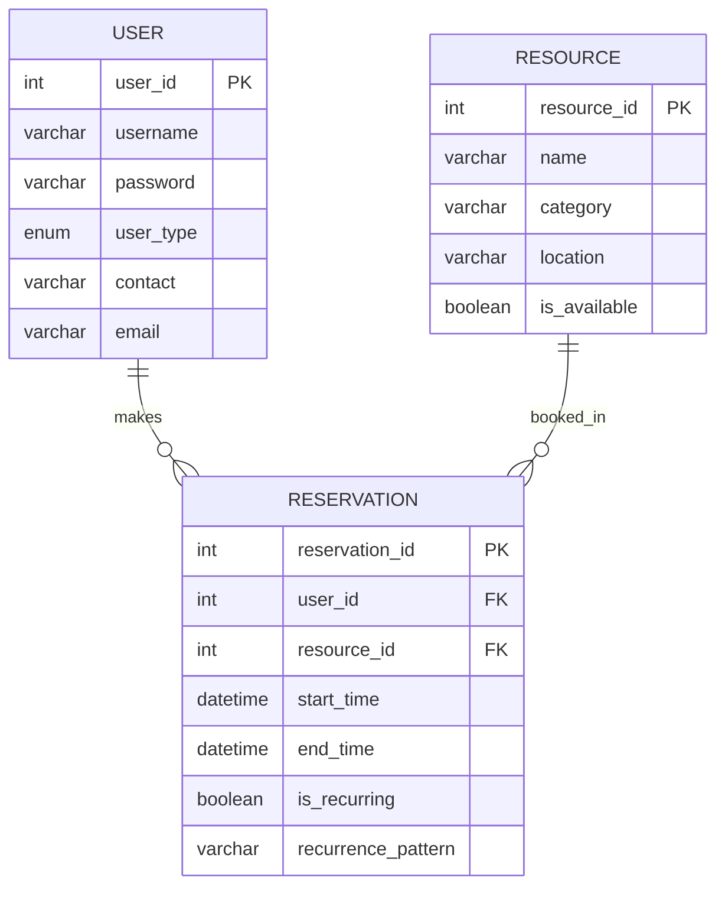

# 资源预约系统的实体-关系图（ER 图）

## ER 图  
下图为资源预约系统的实体-关系图（ERD），展示了各实体之间的关系。

## 表定义说明  

- **USER（用户表）**：存储用户信息。
  - `user_id`：用户唯一标识符（主键）。
  - `username`：用户的登录名。
  - `password`：用户密码（在实际系统中需加密存储）。
  - `user_type`：用户类型枚举，标识为“管理员”或“普通用户”（学生/教师）。
  - `contact`：联系电话（仅管理员可见）。
  - `email`：电子邮箱地址（仅管理员可见）。

- **RESOURCE（资源表）**：存储共享资源的信息。
  - `resource_id`：资源唯一标识符（主键）。
  - `name`：资源名称。
  - `category`：资源类型或类别。
  - `location`：资源的物理位置。
  - `is_available`：资源当前是否可用。

- **RESERVATION（预约表）**：存储预约信息。
  - `reservation_id`：预约记录唯一标识符（主键）。
  - `user_id`：关联发起预约的用户（外键）。
  - `resource_id`：关联被预约的资源（外键）。
  - `start_time`：预约开始时间。
  - `end_time`：预约结束时间。
  - `is_recurring`：是否为周期性预约（例如课程占用）。
  - `recurrence_pattern`：若为周期性预约，描述其重复模式（如每周）。
